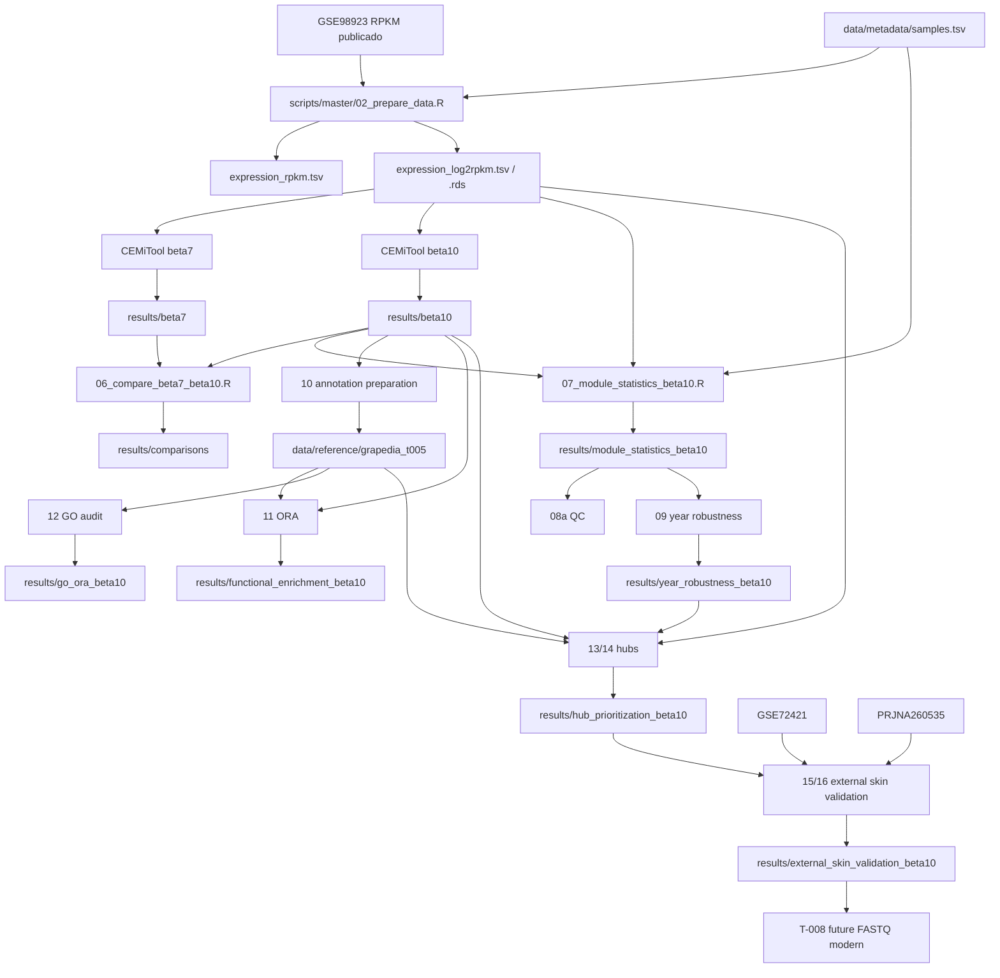

# Linaje maestro de datos

## Flujo principal

## 1. Fuente primaria

`data/raw/geo/GSE98923/GSE98923_RPKM_2012-2013-2014_controls.txt.gz`

→ contiene el RPKM publicado para el estudio.

`data/raw/geo/gse98923_expression_set.rds`

→ metadata GEO serializada.

## 2. Selección de muestras

`data/metadata/samples.tsv`

→ define las 54 muestras, nombres internos, cultivar, etapa, año y réplica.

`scripts/master/02_prepare_data.R`

→ mapea GSM/descripción a columnas del RPKM, valida 54 muestras.

Outputs:
- `sample_geo_map.tsv`
- `expression_rpkm.tsv`
- `expression_log2rpkm.tsv`
- `expression_log2rpkm.rds`

## 3. Construcción de redes

La matriz log2RPKM alimenta beta7 y beta10.

Objetos:
- beta7 histórico/canónico bajo `results/beta7/`;
- beta10 principal bajo `results/beta10/`.

El objeto beta10 contiene membership, parámetros y matriz de adyacencia usada posteriormente.

## 4. Sensibilidad beta

Objetos beta7 + beta10
→ `06_compare_beta7_beta10.R`
→ `results/comparisons/`.

La salida de comparación justifica mantener beta10 como principal y beta7 como sensibilidad.

## 5. Eigengenes y modelo agregado

beta10 membership + log2RPKM + metadata
→ script 07
→ PC1 por módulo
→ modelo `Eigengene ~ Cultivar*Stage + Year`
→ 30 contrastes Stage.

Outputs:
`results/module_statistics_beta10/`.

## 6. QC

Resultados script 07 + inputs congelados
→ 08a
→ auditorías `t003_*.tsv`.

No modifica resultados primarios; verifica.

## 7. Robustez anual

Eigengenes + metadata
→ script 09
→ modelo `Cultivar*Stage*Year`
→ 90 contrastes Stage×Year
→ perfiles/diagnósticos/clasificación.

Outputs:
`results/year_robustness_beta10/`.

## 8. Anotación

Genes beta10 VIT_ legado
→ fuentes Grapedia con SHA
→ script 10
→ mappings v1→v3/v5.1 + gene-term pairs.

Outputs:
`data/reference/grapedia_t005/`.

## 9. ORA

Membership beta10 + anotaciones
→ script 11
→ hipergeométrica + BH
→ MapMan v3/v5 y GO histórico.

Output:
`results/functional_enrichment_beta10/`.

## 10. GO corregido

GO pairs + `go.obo`
→ script 12
→ auditoría de obsolescencia
→ ORA GO limpia.

Output:
`results/go_ora_beta10/`.

Para inferencia GO, esta salida supersede `v5_go_all_terms.tsv` de T-005.

## 11. Hubs

Adjacency beta10 + expression + year robustness + annotations
→ scripts 13/14
→ kWithin, kME, rankings, edges, leave-year-out, zero-rate.

Output:
`results/hub_prioritization_beta10/`.

## 12. Validación externa

Fuentes originales:
- `data/reference/external_t007/GSE72421_*`
- `data/reference/external_t007/PRJNA260535_additional_file_2_log2CPM.xlsx`

PRJNA workbook
→ script 15
→ beta10 subset + metadata.

Hubs congelados + datasets externos
→ script 16
→ comparaciones por condición, cobertura, Welch exploratorio, BH.

Output:
`results/external_skin_validation_beta10/`.

## 13. Reportes

Resultados CEMiTool + comparación + módulo estadístico
→ script 08
→ `reports/current/analysis_report.html/.docx/.pdf`.

El informe actual todavía no incorpora T-004–T-007.

## 14. Futuro T-008

FASTQ SRA
→ QC/alineamiento o pseudoalineamiento moderno
→ referencia/anotación actual
→ counts modernos
→ normalización apropiada
→ comparar genes/módulos/candidatos con baseline.

La regla es comparar, no borrar el baseline histórico.
